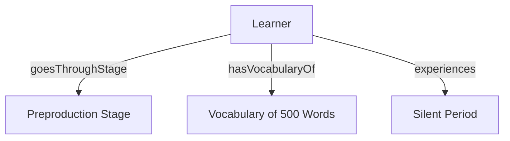
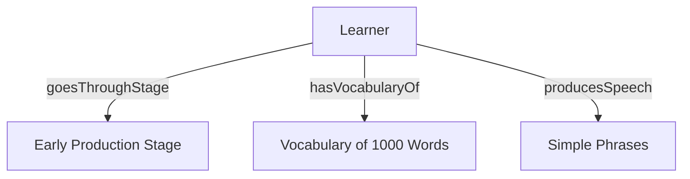
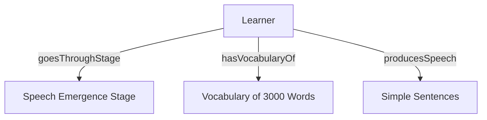
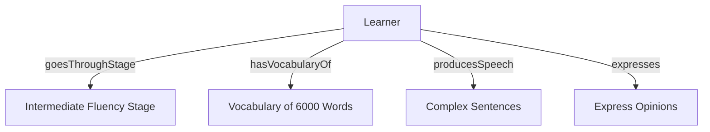
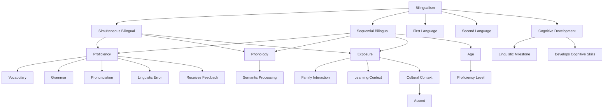

# Language Teaching Ontology Patterns

The repository contains the OWL-based ontology and N-ary relation patterns developed for language teaching, including code, graphical representations, and detailed documentation of design decisions.

Part one focuses on identifying and modeling specific situations using N-ary relation patterns. By analyzing concepts from language teaching, four scenarios are identified and mapped using N-ary relations, with OWL code, graphical representations, and classifications provided for each.

Part two involves the development of an ontology within a specific domain by reusing existing ontologies and patterns. The ontology includes 30 elements, such as classes and properties, along with natural language labels and descriptions. Key design decisions, such as the selection of relevant ontologies and the granularity of the model, are documented, and the final ontology is presented both in OWL format and graphically. The result is a comprehensive knowledge model that represents complex relationships and concepts in urban planning.

## Part 1

<details>
  <summary>Task Description</summary><br>

The objective of this part is to identify at least 4 situations that should be modeled using an N-ary relation pattern.

Situations should be identified in Wikipedia pages about (a) urban planning, (b) building construction or (c) language teaching as a second language. Use Wikipedia in English or Spanish.

For each situation you should provide:

- (General) Situation: A sentence in natural language about generic issues (e.g., "A person has been diagnosed with a disease with a probability").
- (Specific) Situation: A sentence in natural language about specific issues on the general situation (e.g., "Christine has breast tumor with high probability").
- The Wikipedia page (URL) in which you found the situation; or the additional resource you used.
- Graphical representation of the situation you identified.
- OWL Code (using Protégé) for the N-ary relation pattern.

In addition, these new patterns should be classified in the N-ary relation pattern taxonomy.
</details>

---

### Situation 1: Preproduction (Silent Period)

#### General Situation

A learner begins the process of second-language acquisition but has not yet started speaking, only understanding language input.

#### Specific Situation

Maria is in the preproduction stage of language acquisition. She understands around 500 words but does not speak yet.

#### Source

Based on: https://en.wikipedia.org/wiki/Second-language_acquisition#Krashen_stages

#### Graphical Representation

- **Entities**
  - Learner
  - PreproductionStage
  - Vocabulary500Words
  - SilentPeriod
- **Relationships**
  - Learner → goesThroughStage → PreproductionStage
  - Learner → hasVocabularyOf → Vocabulary500Words
  - Learner → experiences → SilentPeriod

<br>



<br>
<div align="center">
  <em>Graphical Representation of the Preproduction Stage.</em>
</div>
<br>

#### OWL Code

```xml
<Declaration>
    <Class IRI="#Learner"/>
    <Class IRI="#PreproductionStage"/>
    <Class IRI="#Vocabulary500Words"/>
    <Class IRI="#SilentPeriod"/>

    <ObjectProperty IRI="#goesThroughStage"/>
    <ObjectProperty IRI="#hasVocabularyOf"/>
    <ObjectProperty IRI="#experiences"/>

    <ClassAssertion>
        <Class IRI="#Learner"/>
        <NamedIndividual IRI="#Maria"/>
    </ClassAssertion>

    <ClassAssertion>
        <Class IRI="#PreproductionStage"/>
        <NamedIndividual IRI="#Preproduction"/>
    </ClassAssertion>

    <ObjectPropertyAssertion>
        <ObjectProperty IRI="#goesThroughStage"/>
        <NamedIndividual IRI="#Maria"/>
        <NamedIndividual IRI="#Preproduction"/>
    </ObjectPropertyAssertion>

    <ClassAssertion>
        <Class IRI="#Vocabulary500Words"/>
        <NamedIndividual IRI="#Vocabulary500"/>
    </ClassAssertion>

    <ObjectPropertyAssertion>
        <ObjectProperty IRI="#hasVocabularyOf"/>
        <NamedIndividual IRI="#Maria"/>
        <NamedIndividual IRI="#Vocabulary500"/>
    </ObjectPropertyAssertion>

    <ClassAssertion>
        <Class IRI="#SilentPeriod"/>
        <NamedIndividual IRI="#SilentPeriod"/>
    </ClassAssertion>

    <ObjectPropertyAssertion>
        <ObjectProperty IRI="#experiences"/>
        <NamedIndividual IRI="#Maria"/>
        <NamedIndividual IRI="#SilentPeriod"/>
    </ObjectPropertyAssertion>
</Declaration>
```

### Situation 2: Early Production Stage

#### General Situation

A learner is in the early production stage of second-language acquisition, where they can use simple phrases or memorized chunks of language, but they may make errors.

#### Specific Situation

Carlos is in the early production stage. He can say simple phrases like "I want apple," but sometimes makes mistakes when using them.
Wikipedia Page:

#### Source

Based on: https://en.wikipedia.org/wiki/Second-language_acquisition#Krashen_stages

#### Graphical Representation

- **Entities**
  - Learner
  - EarlyProductionStage
  - Vocabulary1000Words
  - SimplePhrases
- **Relationships**
  - Learner → goesThroughStage → EarlyProductionStage
  - Learner → hasVocabularyOf → Vocabulary1000Words
  - Learner → producesSpeech → SimplePhrases

<br>



<br>
<div align="center">
  <em>Graphical Representation of the Early Production Stage.</em>
</div>
<br>

#### OWL Code

```xml
<Declaration>
    <Class IRI="#Learner"/>
    <Class IRI="#EarlyProductionStage"/>
    <Class IRI="#Vocabulary1000Words"/>
    <Class IRI="#SimplePhrases"/>

    <ObjectProperty IRI="#goesThroughStage"/>
    <ObjectProperty IRI="#hasVocabularyOf"/>
    <ObjectProperty IRI="#producesSpeech"/>

    <ClassAssertion>
        <Class IRI="#Learner"/>
        <NamedIndividual IRI="#Carlos"/>
    </ClassAssertion>

    <ClassAssertion>
        <Class IRI="#EarlyProductionStage"/>
        <NamedIndividual IRI="#EarlyProduction"/>
    </ClassAssertion>

    <ObjectPropertyAssertion>
        <ObjectProperty IRI="#goesThroughStage"/>
        <NamedIndividual IRI="#Carlos"/>
        <NamedIndividual IRI="#EarlyProduction"/>
    </ObjectPropertyAssertion>

    <ClassAssertion>
        <Class IRI="#Vocabulary1000Words"/>
        <NamedIndividual IRI="#Vocabulary1000"/>
    </ClassAssertion>

    <ObjectPropertyAssertion>
        <ObjectProperty IRI="#hasVocabularyOf"/>
        <NamedIndividual IRI="#Carlos"/>
        <NamedIndividual IRI="#Vocabulary1000"/>
    </ObjectPropertyAssertion>

    <ClassAssertion>
        <Class IRI="#SimplePhrases"/>
        <NamedIndividual IRI="#SimplePhrases1"/>
    </ClassAssertion>

    <ObjectPropertyAssertion>
        <ObjectProperty IRI="#producesSpeech"/>
        <NamedIndividual IRI="#Carlos"/>
        <NamedIndividual IRI="#SimplePhrases1"/>
    </ObjectPropertyAssertion>
</Declaration>
```

### Situation 3: Speech Emergence Stage

#### General Situation:

A learner enters the speech emergence stage of second-language acquisition, where their vocabulary increases and they begin to communicate with simple sentences and questions.

#### Specific Situation

Ling is in the speech emergence stage with a vocabulary of 3000 words. She can ask questions like "Where is the bus?" but still makes some errors with sentence structure.
Wikipedia Page:

#### Source

Based on: https://en.wikipedia.org/wiki/Second-language_acquisition#Krashen_stages

#### Graphical Representation

- **Entities**
  - Learner
  - SpeechEmergenceStage
  - Vocabulary3000Words
  - SimpleSentences
- **Relationships**
  - Learner → goesThroughStage → SpeechEmergenceStage
  - Learner → hasVocabularyOf → Vocabulary3000Words
  - Learner → producesSpeech → SimpleSentences

<br>



<br>
<div align="center">
  <em>Graphical Representation of the Speech Emergence Stage.</em>
</div>
<br>

#### OWL Code

```xml
<Declaration>
    <Class IRI="#Learner"/>
    <Class IRI="#SpeechEmergenceStage"/>
    <Class IRI="#Vocabulary3000Words"/>
    <Class IRI="#SimpleSentences"/>

    <ObjectProperty IRI="#goesThroughStage"/>
    <ObjectProperty IRI="#hasVocabularyOf"/>
    <ObjectProperty IRI="#producesSpeech"/>

    <ClassAssertion>
        <Class IRI="#Learner"/>
        <NamedIndividual IRI="#Ling"/>
    </ClassAssertion>

    <ClassAssertion>
        <Class IRI="#SpeechEmergenceStage"/>
        <NamedIndividual IRI="#SpeechEmergence"/>
    </ClassAssertion>

    <ObjectPropertyAssertion>
        <ObjectProperty IRI="#goesThroughStage"/>
        <NamedIndividual IRI="#Ling"/>
        <NamedIndividual IRI="#SpeechEmergence"/>
    </ObjectPropertyAssertion>

    <ClassAssertion>
        <Class IRI="#Vocabulary3000Words"/>
        <NamedIndividual IRI="#Vocabulary3000"/>
    </ClassAssertion>

    <ObjectPropertyAssertion>
        <ObjectProperty IRI="#hasVocabularyOf"/>
        <NamedIndividual IRI="#Ling"/>
        <NamedIndividual IRI="#Vocabulary3000"/>
    </ObjectPropertyAssertion>

    <ClassAssertion>
        <Class IRI="#SimpleSentences"/>
        <NamedIndividual IRI="#SimpleSentences1"/>
    </ClassAssertion>

    <ObjectPropertyAssertion>
        <ObjectProperty IRI="#producesSpeech"/>
        <NamedIndividual IRI="#Ling"/>
        <NamedIndividual IRI="#SimpleSentences1"/>
    </ObjectPropertyAssertion>
</Declaration>
```

### Situation 4: Intermediate Fluency Stage

#### General Situation

A learner reaches the intermediate fluency stage in second-language acquisition. At this stage, they can communicate in more complex sentences and express opinions, although they still make errors with complicated structures.

#### Specific Situation

Juan is in the intermediate fluency stage with a vocabulary of 6000 words. He can express opinions like "I think the movie was interesting," but sometimes makes mistakes with more complex sentence structures.

#### Source

Based on: https://en.wikipedia.org/wiki/Second-language_acquisition#Krashen_stages

#### Graphical Representation

- **Entities**
  - Learner
  - IntermediateFluencyStage
  - Vocabulary6000Words
  - ComplexSentences
  - ExpressOpinions
- **Relationships**
  - Learner → goesThroughStage → IntermediateFluencyStage
  - Learner → hasVocabularyOf → Vocabulary6000Words
  - Learner → producesSpeech → ComplexSentences
  - Learner → expresses → ExpressOpinions

<br>



<br>
<div align="center">
  <em>Graphical Representation of the Intermediate Fluency Stage.</em>
</div>
<br>

#### OWL Code

```xml
<Declaration>
    <Class IRI="#Learner"/>
    <Class IRI="#IntermediateFluencyStage"/>
    <Class IRI="#Vocabulary6000Words"/>
    <Class IRI="#ComplexSentences"/>
    <Class IRI="#ExpressOpinions"/>

    <ObjectProperty IRI="#goesThroughStage"/>
    <ObjectProperty IRI="#hasVocabularyOf"/>
    <ObjectProperty IRI="#producesSpeech"/>
    <ObjectProperty IRI="#expresses"/>

    <ClassAssertion>
        <Class IRI="#Learner"/>
        <NamedIndividual IRI="#Juan"/>
    </ClassAssertion>

    <ClassAssertion>
        <Class IRI="#IntermediateFluencyStage"/>
        <NamedIndividual IRI="#IntermediateFluency"/>
    </ClassAssertion>

    <ObjectPropertyAssertion>
        <ObjectProperty IRI="#goesThroughStage"/>
        <NamedIndividual IRI="#Juan"/>
        <NamedIndividual IRI="#IntermediateFluency"/>
    </ObjectPropertyAssertion>

    <ClassAssertion>
        <Class IRI="#Vocabulary6000Words"/>
        <NamedIndividual IRI="#Vocabulary6000"/>
    </ClassAssertion>

    <ObjectPropertyAssertion>
        <ObjectProperty IRI="#hasVocabularyOf"/>
        <NamedIndividual IRI="#Juan"/>
        <NamedIndividual IRI="#Vocabulary6000"/>
    </ObjectPropertyAssertion>

    <ClassAssertion>
        <Class IRI="#ComplexSentences"/>
        <NamedIndividual IRI="#ComplexSentences1"/>
    </ClassAssertion>

    <ObjectPropertyAssertion>
        <ObjectProperty IRI="#producesSpeech"/>
        <NamedIndividual IRI="#Juan"/>
        <NamedIndividual IRI="#ComplexSentences1"/>
    </ObjectPropertyAssertion>

    <ClassAssertion>
        <Class IRI="#ExpressOpinions"/>
        <NamedIndividual IRI="#ExpressOpinions1"/>
    </ClassAssertion>

    <ObjectPropertyAssertion>
        <ObjectProperty IRI="#expresses"/>
        <NamedIndividual IRI="#Juan"/>
        <NamedIndividual IRI="#ExpressOpinions1"/>
    </ObjectPropertyAssertion>
</Declaration>
```

## Part 2

<details>
  <summary>Task Description</summary><br>

The main objective of this part is to develop an ontology (implemented in OWL) in a particular domain. The building of such an ontology network should be done reusing as much as possible existing ontologies and ontology design patterns. The ontology should include at least 30 elements (concepts and properties) model by you. These elements should include label and description in natural language.

The ontology to be developed should model the knowledge gathered from Wikipedia pages (English or Spanish) or additional resources about (a) urban planning, (b) building construction or (c) language teaching as a second language.

In order to describe this part, you should provide: the Wikipedia pages (URL) or additional resources that serve as a set of requirements the list of reused resources explaining how they were found and why they were selected the list of elements modeled by you a graphical view of the ontology main design decisions taken during the ontology development as well as any comment or consideration you consider useful.
</details>

---

### Sources of Information

The ontology was developed based on the following Wikipedia pages:

  - [Bilingualism](https://en.wikipedia.org/wiki/Bilingualism)
  - [Simultaneous bilingualism](https://en.wikipedia.org/wiki/Simultaneous_bilingualism)
  - [Sequential bilingualism](https://en.wikipedia.org/wiki/Sequential_bilingualism)
  - [Language acquisition](https://en.wikipedia.org/wiki/Language_acquisition)

### Purpose of the Ontology

The ontology will model the key concepts related to language teaching as a second language, focusing on bilingualism and second language acquisition. It will capture various aspects of language learning and proficiency, such as the types of bilingualism (simultaneous and sequential), their language proficiency, language development, age factors, and the impact of language exposure on proficiency. The ontology should represent concepts, relationships, and properties in second language acquisition and bilingualism.

### Reused Resources

#### Ontologies and Patterns

- **Dublin Core**: To describe general educational resources.
- **Linguistic Linked Open Data (LLOD)**: Useful for capturing linguistic concepts and relationships.
- **Open Education Ontology**: Relevant for educational strategies.

#### **Selection Criteria**:
- **Relevance**: These ontologies are related to language learning, proficiency, and bilingualism.
- **Reusability**: These ontologies provide commonly used classes and properties in educational domains.
- **Compatibility**: All ontologies are OWL-compatible, ensuring smooth integration.

### Modeled Elements

The following **30 elements** were modeled based on the sources:

#### **Concepts:**

1. **Simultaneous Bilingual**: A child who learns two languages from birth and grows up knowing both languages.
2. **Sequential Bilingual**: A child who learns one language from birth and another at some point during childhood.
3. **Language**: A system of communication used by people, either first or second language.
4. **First Language**: A person’s first language, typically learned from birth.
5. **Second Language**: A language learned after the first language, often later in life.
6. **Proficiency**: The degree of skill and ability in a language, which can be influenced by age and exposure.
7. **Age**: The age at which language acquisition starts or is developed.
8. **Cognitive Development**: The development of mental skills, especially related to language and cognition.
9. **Linguistic Milestone**: A developmental stage in language acquisition, such as vocabulary or grammar mastery.
10. **Exposure**: The amount and quality of contact with a language, affecting proficiency.
11. **Family Interaction**: Communication with family members, which influences language development.
12. **Accent**: The distinct pronunciation of a language that can be influenced by age at acquisition.
13. **Vocabulary**: The set of words a person knows in a language.
14. **Grammar**: The rules governing the structure of sentences in a language.
15. **Pronunciation**: The way words are pronounced, often affected by age when learning a second language.
16. **Linguistic Error**: Mistakes in language production, such as incorrect grammar or vocabulary.
17. **Phonology**: The study of sounds in a language, especially pronunciation differences in bilinguals.
18. **Semantic Processing**: The process of understanding the meaning of words and sentences in a language.
19. **Learning Context**: The environment or situation in which language acquisition takes place.
20. **Cultural Context**: The cultural factors that influence language use and acquisition.

#### **Properties:**

21. **hasProficiencyLevel**: The proficiency level a learner has in a given language.
22. **hasAge**: The age at which a child starts learning a language.
23. **learnsFrom**: Indicates the relationship between the learner and the language(s) they acquire.
24. **acquiresIn**: The context or environment in which language acquisition happens.
25. **hasVocabularySize**: The number of words a person knows in a language.
26. **hasAccent**: The presence of a specific accent in a person’s second language pronunciation.
27. **hasLinguisticError**: The errors made during language use, related to proficiency.
28. **developsCognitiveSkills**: The relationship between language acquisition and cognitive development.
29. **receivesExposure**: The relationship between a learner and their exposure to the language.
30. **speaksWithFamily**: The interaction with family members that influences language learning.

### **Graphical View**



<br>

<div align="center">
  <em>Graphical Representation of the Language Teaching Ontology.</em>
</div>

### OWL Code

```xml
<rdf:RDF xmlns:rdf="http://www.w3.org/1999/02/22-rdf-syntax-ns#"
         xmlns:rdfs="http://www.w3.org/2000/01/rdf-schema#"
         xmlns:owl="http://www.w3.org/2002/07/owl#"
         xmlns:xsd="http://www.w3.org/2001/XMLSchema#"
         xmlns="http://example.org/bilingualism#">

    <owl:Ontology rdf:about="http://example.org/bilingualism"/>

    <!-- Classes -->
    <owl:Class rdf:about="#Bilingualism"/>
    <owl:Class rdf:about="#SimultaneousBilingual"/>
    <owl:Class rdf:about="#SequentialBilingual"/>
    <owl:Class rdf:about="#Proficiency"/>
    <owl:Class rdf:about="#Vocabulary"/>
    <owl:Class rdf:about="#Grammar"/>
    <owl:Class rdf:about="#Pronunciation"/>
    <owl:Class rdf:about="#LinguisticError"/>
    <owl:Class rdf:about="#Phonology"/>
    <owl:Class rdf:about="#SemanticProcessing"/>
    <owl:Class rdf:about="#FirstLanguage"/>
    <owl:Class rdf:about="#SecondLanguage"/>
    <owl:Class rdf:about="#Exposure"/>
    <owl:Class rdf:about="#FamilyInteraction"/>
    <owl:Class rdf:about="#LearningContext"/>
    <owl:Class rdf:about="#CulturalContext"/>
    <owl:Class rdf:about="#Accent"/>
    <owl:Class rdf:about="#Age"/>
    <owl:Class rdf:about="#ProficiencyLevel"/>
    <owl:Class rdf:about="#CognitiveDevelopment"/>
    <owl:Class rdf:about="#LinguisticMilestone"/>
    <owl:Class rdf:about="#DevelopsCognitiveSkills"/>
    <owl:Class rdf:about="#ReceivesFeedback"/>

    <!-- Class Hierarchies -->
    <rdfs:subClassOf rdf:resource="#Bilingualism" rdf:about="#SimultaneousBilingual"/>
    <rdfs:subClassOf rdf:resource="#Bilingualism" rdf:about="#SequentialBilingual"/>
    <rdfs:subClassOf rdf:resource="#SimultaneousBilingual" rdf:about="#Proficiency"/>
    <rdfs:subClassOf rdf:resource="#SequentialBilingual" rdf:about="#Proficiency"/>
    <rdfs:subClassOf rdf:resource="#Proficiency" rdf:about="#Vocabulary"/>
    <rdfs:subClassOf rdf:resource="#Proficiency" rdf:about="#Grammar"/>
    <rdfs:subClassOf rdf:resource="#Proficiency" rdf:about="#Pronunciation"/>
    <rdfs:subClassOf rdf:resource="#Proficiency" rdf:about="#LinguisticError"/>
    <rdfs:subClassOf rdf:resource="#Proficiency" rdf:about="#Phonology"/>
    <rdfs:subClassOf rdf:resource="#Phonology" rdf:about="#SemanticProcessing"/>
    <rdfs:subClassOf rdf:resource="#Bilingualism" rdf:about="#FirstLanguage"/>
    <rdfs:subClassOf rdf:resource="#Bilingualism" rdf:about="#SecondLanguage"/>
    <rdfs:subClassOf rdf:resource="#SimultaneousBilingual" rdf:about="#Exposure"/>
    <rdfs:subClassOf rdf:resource="#SequentialBilingual" rdf:about="#Exposure"/>
    <rdfs:subClassOf rdf:resource="#Exposure" rdf:about="#FamilyInteraction"/>
    <rdfs:subClassOf rdf:resource="#Exposure" rdf:about="#LearningContext"/>
    <rdfs:subClassOf rdf:resource="#Exposure" rdf:about="#CulturalContext"/>
    <rdfs:subClassOf rdf:resource="#CulturalContext" rdf:about="#Accent"/>
    <rdfs:subClassOf rdf:resource="#SequentialBilingual" rdf:about="#Age"/>
    <rdfs:subClassOf rdf:resource="#Age" rdf:about="#ProficiencyLevel"/>
    <rdfs:subClassOf rdf:resource="#Bilingualism" rdf:about="#CognitiveDevelopment"/>
    <rdfs:subClassOf rdf:resource="#CognitiveDevelopment" rdf:about="#LinguisticMilestone"/>
    <rdfs:subClassOf rdf:resource="#CognitiveDevelopment" rdf:about="#DevelopsCognitiveSkills"/>
    <rdfs:subClassOf rdf:resource="#Proficiency" rdf:about="#ReceivesFeedback"/>

    <!-- Properties -->
    <owl:ObjectProperty rdf:about="#hasProficiency"/>
    <owl:ObjectProperty rdf:about="#hasLanguage"/>
    <owl:ObjectProperty rdf:about="#hasExposure"/>
    <owl:ObjectProperty rdf:about="#hasFeedback"/>
    <owl:ObjectProperty rdf:about="#hasContext"/>
    <owl:ObjectProperty rdf:about="#hasAge"/>

    <rdf:Description rdf:about="#SimultaneousBilingual">
        <hasProficiency rdf:resource="#Proficiency"/>
    </rdf:Description>

    <rdf:Description rdf:about="#SequentialBilingual">
        <hasProficiency rdf:resource="#Proficiency"/>
        <hasAge rdf:resource="#Age"/>
    </rdf:Description>
</rdf:RDF>
```

### Design Decisions

- **Granularity**: The ontology has a broad focus on linguistic and cognitive factors, making it versatile for educational research.
- **Hierarchical Structure**: The ontology uses a clear hierarchical structure, starting with general concepts (e.g., **Bilingualism**) and breaking down into specific properties (e.g., **Proficiency**, **Accent**).
- **Reusability**: Key ontologies like **Dublin Core** and **LLOD** are used to capture linguistic and educational concepts, ensuring that the ontology is compatible with future integrations or extensions.
