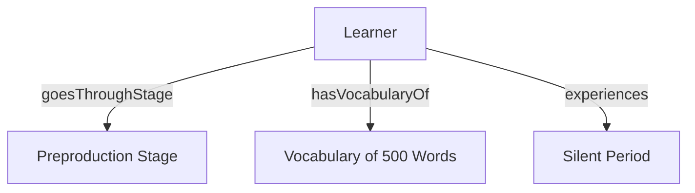
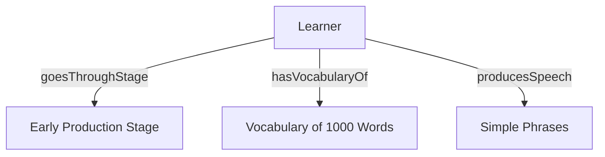
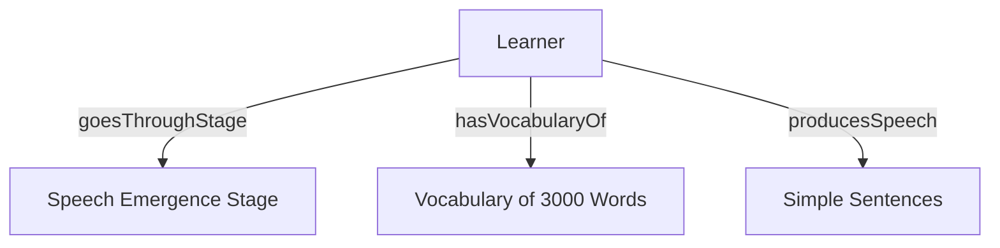
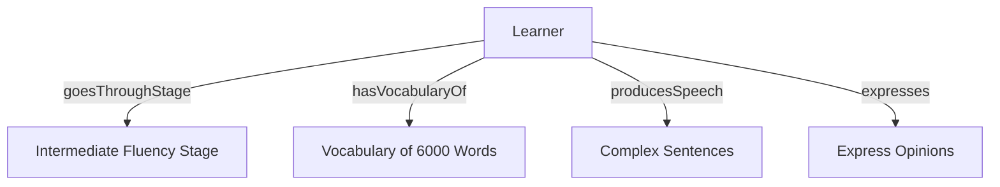

# Language Teaching Ontology Patterns

## Part 1

<details>
  <summary>Task Description</summary><br>

The objective of this part is to identify at least 4 situations that should be modeled using an N-ary relation pattern.

Situations should be identified in Wikipedia pages about (a) urban planning, (b) building construction or (c) language teaching as a second language. YUse Wikipedia in English or Spanish.

For each situation you should provide:

- (General) Situation: A sentence in natural language about generic issues (e.g., "A person has been diagnosed with a disease with a probability").
- (Specific) Situation: A sentence in natural language about specific issues on the general situation (e.g., "Christine has breast tumor with high probability").
- The Wikipedia page (URL) in which you found the situation; or the additional resource you used.
- Graphical representation of the situation you identified.
- OWL Code (using Protégé) for the N-ary relation pattern.

In addition, these new patterns should be classified in the N-ary relation pattern taxonomy.
</details>

---

### Situation 1: Preproduction (Silent Period)

#### General Situation

A learner begins the process of second-language acquisition but has not yet started speaking, only understanding language input.

#### Specific Situation

Maria is in the preproduction stage of language acquisition. She understands around 500 words but does not speak yet.

#### Source

Based on: https://en.wikipedia.org/wiki/Second-language_acquisition#Krashen_stages

#### Graphical Representation

- **Entities**
  - Learner
  - PreproductionStage
  - Vocabulary500Words
  - SilentPeriod
- **Relationships**
  - Learner → goesThroughStage → PreproductionStage
  - Learner → hasVocabularyOf → Vocabulary500Words
  - Learner → experiences → SilentPeriod

<br>



<br>
<div align="center">
  <em>Graphical Representation of the Preproduction Stage.</em>
</div>
<br>

#### OWL Code:

```xml
<Declaration>
    <Class IRI="#Learner"/>
    <Class IRI="#PreproductionStage"/>
    <Class IRI="#Vocabulary500Words"/>
    <Class IRI="#SilentPeriod"/>

    <ObjectProperty IRI="#goesThroughStage"/>
    <ObjectProperty IRI="#hasVocabularyOf"/>
    <ObjectProperty IRI="#experiences"/>

    <ClassAssertion>
        <Class IRI="#Learner"/>
        <NamedIndividual IRI="#Maria"/>
    </ClassAssertion>

    <ClassAssertion>
        <Class IRI="#PreproductionStage"/>
        <NamedIndividual IRI="#Preproduction"/>
    </ClassAssertion>

    <ObjectPropertyAssertion>
        <ObjectProperty IRI="#goesThroughStage"/>
        <NamedIndividual IRI="#Maria"/>
        <NamedIndividual IRI="#Preproduction"/>
    </ObjectPropertyAssertion>

    <ClassAssertion>
        <Class IRI="#Vocabulary500Words"/>
        <NamedIndividual IRI="#Vocabulary500"/>
    </ClassAssertion>

    <ObjectPropertyAssertion>
        <ObjectProperty IRI="#hasVocabularyOf"/>
        <NamedIndividual IRI="#Maria"/>
        <NamedIndividual IRI="#Vocabulary500"/>
    </ObjectPropertyAssertion>

    <ClassAssertion>
        <Class IRI="#SilentPeriod"/>
        <NamedIndividual IRI="#SilentPeriod"/>
    </ClassAssertion>

    <ObjectPropertyAssertion>
        <ObjectProperty IRI="#experiences"/>
        <NamedIndividual IRI="#Maria"/>
        <NamedIndividual IRI="#SilentPeriod"/>
    </ObjectPropertyAssertion>
</Declaration>
```

### Situation 2: Early Production Stage

#### General Situation

A learner is in the early production stage of second-language acquisition, where they can use simple phrases or memorized chunks of language, but they may make errors.

#### Specific Situation

Carlos is in the early production stage. He can say simple phrases like "I want apple," but sometimes makes mistakes when using them.
Wikipedia Page:

#### Source

Based on: https://en.wikipedia.org/wiki/Second-language_acquisition#Krashen_stages

#### Graphical Representation

- **Entities**
  - Learner
  - EarlyProductionStage
  - Vocabulary1000Words
  - SimplePhrases
- **Relationships**
  - Learner → goesThroughStage → EarlyProductionStage
  - Learner → hasVocabularyOf → Vocabulary1000Words
  - Learner → producesSpeech → SimplePhrases

<br>



<br>
<div align="center">
  <em>Graphical Representation of the Early Production Stage.</em>
</div>
<br>

#### OWL Code:

```xml
<Declaration>
    <Class IRI="#Learner"/>
    <Class IRI="#EarlyProductionStage"/>
    <Class IRI="#Vocabulary1000Words"/>
    <Class IRI="#SimplePhrases"/>

    <ObjectProperty IRI="#goesThroughStage"/>
    <ObjectProperty IRI="#hasVocabularyOf"/>
    <ObjectProperty IRI="#producesSpeech"/>

    <ClassAssertion>
        <Class IRI="#Learner"/>
        <NamedIndividual IRI="#Carlos"/>
    </ClassAssertion>

    <ClassAssertion>
        <Class IRI="#EarlyProductionStage"/>
        <NamedIndividual IRI="#EarlyProduction"/>
    </ClassAssertion>

    <ObjectPropertyAssertion>
        <ObjectProperty IRI="#goesThroughStage"/>
        <NamedIndividual IRI="#Carlos"/>
        <NamedIndividual IRI="#EarlyProduction"/>
    </ObjectPropertyAssertion>

    <ClassAssertion>
        <Class IRI="#Vocabulary1000Words"/>
        <NamedIndividual IRI="#Vocabulary1000"/>
    </ClassAssertion>

    <ObjectPropertyAssertion>
        <ObjectProperty IRI="#hasVocabularyOf"/>
        <NamedIndividual IRI="#Carlos"/>
        <NamedIndividual IRI="#Vocabulary1000"/>
    </ObjectPropertyAssertion>

    <ClassAssertion>
        <Class IRI="#SimplePhrases"/>
        <NamedIndividual IRI="#SimplePhrases1"/>
    </ClassAssertion>

    <ObjectPropertyAssertion>
        <ObjectProperty IRI="#producesSpeech"/>
        <NamedIndividual IRI="#Carlos"/>
        <NamedIndividual IRI="#SimplePhrases1"/>
    </ObjectPropertyAssertion>
</Declaration>
```

### Situation 3: Speech Emergence Stage

#### General Situation:

A learner enters the speech emergence stage of second-language acquisition, where their vocabulary increases and they begin to communicate with simple sentences and questions.

#### Specific Situation

Ling is in the speech emergence stage with a vocabulary of 3000 words. She can ask questions like "Where is the bus?" but still makes some errors with sentence structure.
Wikipedia Page:

#### Source

Based on: https://en.wikipedia.org/wiki/Second-language_acquisition#Krashen_stages

#### Graphical Representation

- **Entities**
  - Learner
  - SpeechEmergenceStage
  - Vocabulary3000Words
  - SimpleSentences
- **Relationships**
  - Learner → goesThroughStage → SpeechEmergenceStage
  - Learner → hasVocabularyOf → Vocabulary3000Words
  - Learner → producesSpeech → SimpleSentences

<br>



<br>
<div align="center">
  <em>Graphical Representation of the Speech Emergence Stage.</em>
</div>
<br>

#### OWL Code

```xml
<Declaration>
    <Class IRI="#Learner"/>
    <Class IRI="#SpeechEmergenceStage"/>
    <Class IRI="#Vocabulary3000Words"/>
    <Class IRI="#SimpleSentences"/>

    <ObjectProperty IRI="#goesThroughStage"/>
    <ObjectProperty IRI="#hasVocabularyOf"/>
    <ObjectProperty IRI="#producesSpeech"/>

    <ClassAssertion>
        <Class IRI="#Learner"/>
        <NamedIndividual IRI="#Ling"/>
    </ClassAssertion>

    <ClassAssertion>
        <Class IRI="#SpeechEmergenceStage"/>
        <NamedIndividual IRI="#SpeechEmergence"/>
    </ClassAssertion>

    <ObjectPropertyAssertion>
        <ObjectProperty IRI="#goesThroughStage"/>
        <NamedIndividual IRI="#Ling"/>
        <NamedIndividual IRI="#SpeechEmergence"/>
    </ObjectPropertyAssertion>

    <ClassAssertion>
        <Class IRI="#Vocabulary3000Words"/>
        <NamedIndividual IRI="#Vocabulary3000"/>
    </ClassAssertion>

    <ObjectPropertyAssertion>
        <ObjectProperty IRI="#hasVocabularyOf"/>
        <NamedIndividual IRI="#Ling"/>
        <NamedIndividual IRI="#Vocabulary3000"/>
    </ObjectPropertyAssertion>

    <ClassAssertion>
        <Class IRI="#SimpleSentences"/>
        <NamedIndividual IRI="#SimpleSentences1"/>
    </ClassAssertion>

    <ObjectPropertyAssertion>
        <ObjectProperty IRI="#producesSpeech"/>
        <NamedIndividual IRI="#Ling"/>
        <NamedIndividual IRI="#SimpleSentences1"/>
    </ObjectPropertyAssertion>
</Declaration>
```

### Situation 4: Intermediate Fluency Stage

#### General Situation

A learner reaches the intermediate fluency stage in second-language acquisition. At this stage, they can communicate in more complex sentences and express opinions, although they still make errors with complicated structures.

#### Specific Situation

Juan is in the intermediate fluency stage with a vocabulary of 6000 words. He can express opinions like "I think the movie was interesting," but sometimes makes mistakes with more complex sentence structures.

#### Wikipedia Page

Based on: https://en.wikipedia.org/wiki/Second-language_acquisition#Krashen_stages

#### Graphical Representation

- **Entities**
  - Learner
  - IntermediateFluencyStage
  - Vocabulary6000Words
  - ComplexSentences
  - ExpressOpinions
- **Relationships**
  - Learner → goesThroughStage → IntermediateFluencyStage
  - Learner → hasVocabularyOf → Vocabulary6000Words
  - Learner → producesSpeech → ComplexSentences
  - Learner → expresses → ExpressOpinions

<br>



<br>
<div align="center">
  <em>Graphical Representation of the Intermediate Fluency Stage.</em>
</div>
<br>

#### OWL Code

```xml
<Declaration>
    <Class IRI="#Learner"/>
    <Class IRI="#IntermediateFluencyStage"/>
    <Class IRI="#Vocabulary6000Words"/>
    <Class IRI="#ComplexSentences"/>
    <Class IRI="#ExpressOpinions"/>

    <ObjectProperty IRI="#goesThroughStage"/>
    <ObjectProperty IRI="#hasVocabularyOf"/>
    <ObjectProperty IRI="#producesSpeech"/>
    <ObjectProperty IRI="#expresses"/>

    <ClassAssertion>
        <Class IRI="#Learner"/>
        <NamedIndividual IRI="#Juan"/>
    </ClassAssertion>

    <ClassAssertion>
        <Class IRI="#IntermediateFluencyStage"/>
        <NamedIndividual IRI="#IntermediateFluency"/>
    </ClassAssertion>

    <ObjectPropertyAssertion>
        <ObjectProperty IRI="#goesThroughStage"/>
        <NamedIndividual IRI="#Juan"/>
        <NamedIndividual IRI="#IntermediateFluency"/>
    </ObjectPropertyAssertion>

    <ClassAssertion>
        <Class IRI="#Vocabulary6000Words"/>
        <NamedIndividual IRI="#Vocabulary6000"/>
    </ClassAssertion>

    <ObjectPropertyAssertion>
        <ObjectProperty IRI="#hasVocabularyOf"/>
        <NamedIndividual IRI="#Juan"/>
        <NamedIndividual IRI="#Vocabulary6000"/>
    </ObjectPropertyAssertion>

    <ClassAssertion>
        <Class IRI="#ComplexSentences"/>
        <NamedIndividual IRI="#ComplexSentences1"/>
    </ClassAssertion>

    <ObjectPropertyAssertion>
        <ObjectProperty IRI="#producesSpeech"/>
        <NamedIndividual IRI="#Juan"/>
        <NamedIndividual IRI="#ComplexSentences1"/>
    </ObjectPropertyAssertion>

    <ClassAssertion>
        <Class IRI="#ExpressOpinions"/>
        <NamedIndividual IRI="#ExpressOpinions1"/>
    </ClassAssertion>

    <ObjectPropertyAssertion>
        <ObjectProperty IRI="#expresses"/>
        <NamedIndividual IRI="#Juan"/>
        <NamedIndividual IRI="#ExpressOpinions1"/>
    </ObjectPropertyAssertion>
</Declaration>
```

## Part 2

<details>
  <summary>Task Description</summary><br>

The main objective of this part is to develop an ontology (implemented in OWL) in a particular domain. The building of such an ontology network should be done reusing as much as possible existing ontologies and ontology design patterns. The ontology should include at least 30 elements (concepts and properties) model by you. These elements should include label and description in natural language.

The ontology to be developed should model the knowledge gathered from Wikipedia pages (English or Spanish) or additional resources about (a) urban planning, (b) building construction or (c) language teaching as a second language.

In order to describe this part, you should provide: the Wikipedia pages (URL) or additional resources that serve as a set of requirements the list of reused resources explaining how they were found and why they were selected the list of elements modeled by you a graphical view of the ontology main design decisions taken during the ontology development as well as any comment or consideration you consider useful.
</details>

---
